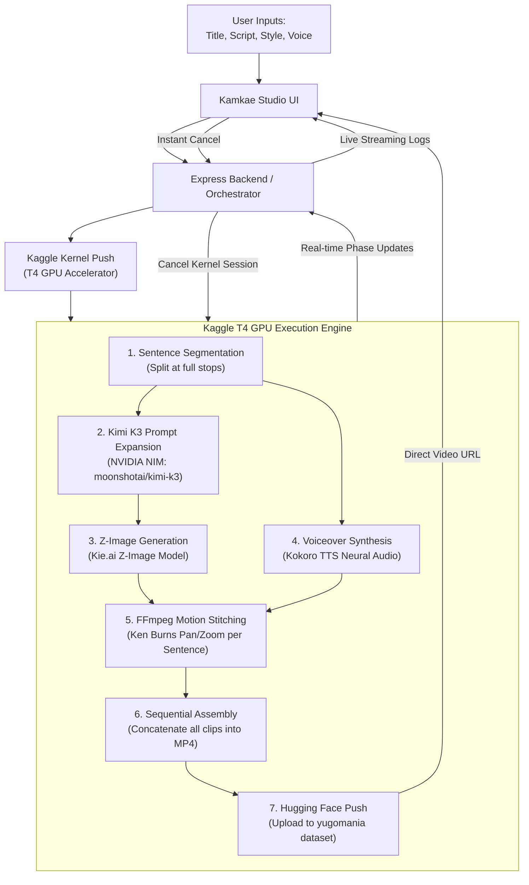

# Kamkae Studio 🎬
> Faceless AI Video Automation Studio powered by **NVIDIA NIM (Kimi K3)**, **Kie.ai (Z-Image)**, **Kokoro TTS**, **Kaggle T4 GPU Accelerator**, and **Hugging Face Hub**.

---

## 🌟 Overview

Kamkae Studio transforms raw scripts into fully synchronized moving-image cinematic video compilations timed precisely to each spoken sentence:

$$\text{Sentence}_i \implies \text{Image}_i + \text{Audio}_i = \text{Clip}_i$$
$$\text{Clip}_1 + \text{Clip}_2 + \dots + \text{Clip}_n = \text{Final Video}$$

---

## ⚡ Architecture & Pipeline



---

## 🛠️ Tech Stack & Services

- **LLM Prompt Expansion**: NVIDIA NIM API (`moonshotai/kimi-k3`)
- **Image Generation**: Kie.ai API (`z-image` foundation model)
- **Voiceover TTS**: Kokoro TTS (high quality neural voice synthesis)
- **Video Motion Engine**: FFmpeg dynamic pan-and-scan (`zoompan` Ken Burns effect)
- **Cloud Accelerator**: Kaggle T4 GPU (`machine_shape: NvidiaTeslaT4`, `enable_gpu: true`)
- **Video Storage & CDN**: Hugging Face Datasets (`yugomania/kamkae-studio-generated`)
- **Database & Auth**: Firebase Auth + Cloud Firestore (with local fallback)
- **Frontend**: Responsive Glassmorphic Studio UI (Vanilla CSS + HTML5)

---

## 🚀 Quick Start

### 1. Start Dev Server
```bash
npm start
```
Open **`http://localhost:3000`** in your browser.

### 2. Run Automation
1. Enter your **Video Title** and **Script** (e.g., the Merlin sample script).
2. Choose an **Animation Style** (Dark Fantasy, Ghibli Anime, Cyberpunk, Pixar 3D, etc.).
3. Choose a **Kokoro TTS Voice** and **Aspect Ratio** (16:9 Cinema or 9:16 Shorts).
4. Click **Run Automation Pipeline**.
5. Watch real-time execution logs and preview/download the finished video.
6. Click **Instant Cancel** anytime to abort running sessions immediately.

---

## 🔥 Firebase Setup (1-Minute Configuration)

To enable live multi-user Firebase Authentication and Cloud Firestore syncing:
1. Go to [Firebase Console](https://console.firebase.google.com/) and create a project named `kamkae-studio`.
2. Enable **Authentication** (Email/Password) and **Firestore Database** (in test mode).
3. Under Project Settings &rarr; Your Apps &rarr; Web (`</>`), copy the config keys:
4. Add them to [.env](file:///home/gamp/kamkae-studio/.env):
   ```env
   FIREBASE_API_KEY=AIzaSy...
   FIREBASE_AUTH_DOMAIN=kamkae-studio.firebaseapp.com
   FIREBASE_PROJECT_ID=kamkae-studio
   FIREBASE_STORAGE_BUCKET=kamkae-studio.appspot.com
   FIREBASE_MESSAGING_SENDER_ID=...
   FIREBASE_APP_ID=...
   ```
5. Deploy to Firebase Hosting when ready:
   ```bash
   npx firebase-tools deploy --only hosting
   ```
